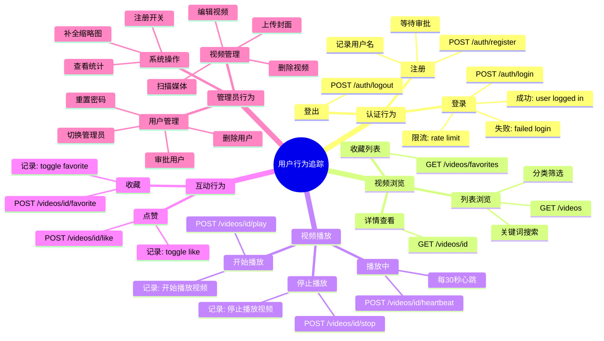
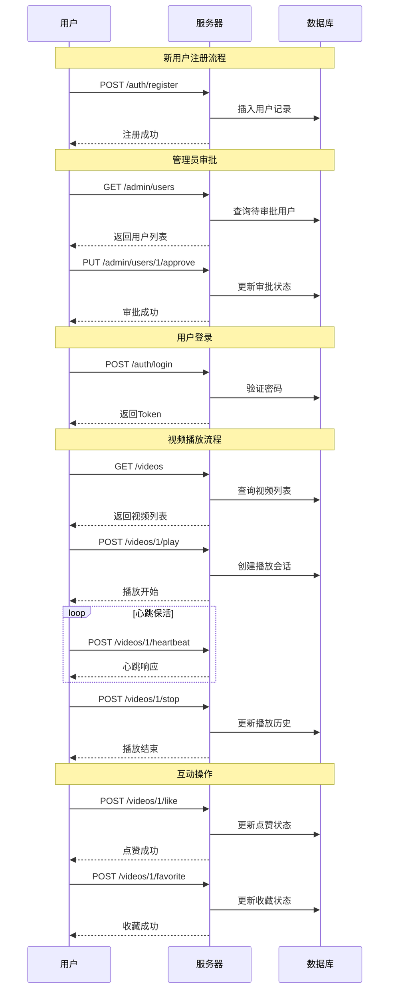
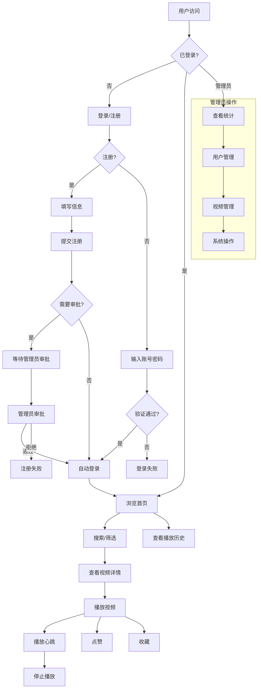
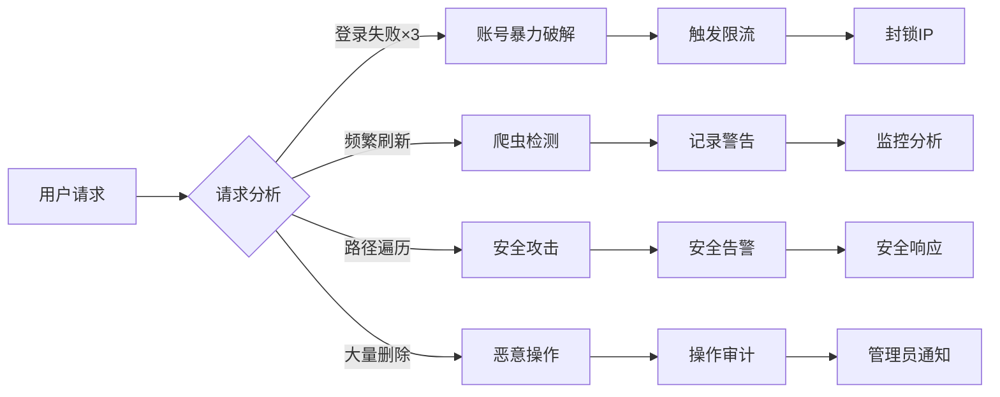

# 用户行为追踪 - Mermaid 思维导图

```mermaid
mindmap
  root((用户行为追踪))
    认证行为
      注册
        POST /auth/register
        记录用户名
        等待审批
      登录
        POST /auth/login
        成功: user logged in
        失败: failed login
        限流: rate limit
      登出
        POST /auth/logout
    视频浏览
      列表浏览
        GET /videos
        分类筛选
        关键词搜索
      详情查看
        GET /videos/id
      收藏列表
        GET /videos/favorites
    视频播放
      开始播放
        POST /videos/id/play
        记录: 开始播放视频
      播放中
        POST /videos/id/heartbeat
        每30秒心跳
      停止播放
        POST /videos/id/stop
        记录: 停止播放视频
    互动行为
      点赞
        POST /videos/id/like
        记录: toggle like
      收藏
        POST /videos/id/favorite
        记录: toggle favorite
    管理员行为
      用户管理
        审批用户
        重置密码
        切换管理员
        删除用户
      视频管理
        编辑视频
        删除视频
        上传封面
        扫描媒体
      系统操作
        查看统计
        注册开关
        补全缩略图
```

## 用户行为时间线

```mermaid
sequenceDiagram
    participant U as 用户
    participant S as 服务器
    participant DB as 数据库

    Note over U,DB: 新用户注册流程
    U->>S: POST /auth/register
    S->>DB: 插入用户记录
    S-->>U: 注册成功

    Note over U,DB: 管理员审批
    U->>S: GET /admin/users
    S->>DB: 查询待审批用户
    S-->>U: 返回用户列表
    U->>S: PUT /admin/users/1/approve
    S->>DB: 更新审批状态
    S-->>U: 审批成功

    Note over U,DB: 用户登录
    U->>S: POST /auth/login
    S->>DB: 验证密码
    S-->>U: 返回Token

    Note over U,DB: 视频播放流程
    U->>S: GET /videos
    S->>DB: 查询视频列表
    S-->>U: 返回视频列表
    U->>S: POST /videos/1/play
    S->>DB: 创建播放会话
    S-->>U: 播放开始
    loop 心跳保活
        U->>S: POST /videos/1/heartbeat
        S-->>U: 心跳响应
    end
    U->>S: POST /videos/1/stop
    S->>DB: 更新播放历史
    S-->>U: 播放结束

    Note over U,DB: 互动操作
    U->>S: POST /videos/1/like
    S->>DB: 更新点赞状态
    S-->>U: 点赞成功
    U->>S: POST /videos/1/favorite
    S->>DB: 更新收藏状态
    S-->>U: 收藏成功
```

## 行为分析流程图

```mermaid
flowchart TD
    A[用户访问] --> B{已登录?}
    B -->|否| C[登录/注册]
    B -->|是| D[浏览首页]
    
    C --> E{注册?}
    E -->|是| F[填写信息]
    E -->|否| G[输入账号密码]
    
    F --> H[提交注册]
    H --> I{需要审批?}
    I -->|是| J[等待管理员审批]
    I -->|否| K[自动登录]
    
    J --> L[管理员审批]
    L -->|通过| K
    L -->|拒绝| M[注册失败]
    
    G --> N{验证通过?}
    N -->|是| K
    N -->|否| O[登录失败]
    
    K --> D
    D --> P[搜索/筛选]
    P --> Q[查看视频详情]
    Q --> R[播放视频]
    
    R --> S[播放心跳]
    S --> T[停止播放]
    
    R --> U[点赞]
    R --> V[收藏]
    
    D --> W[查看播放历史]
    
    subgraph 管理员操作
        X[查看统计] --> Y[用户管理]
        Y --> Z[视频管理]
        Z --> AA[系统操作]
    end
    
    B -->|管理员| X
```

## 异常行为检测

```mermaid
flowchart LR
    A[用户请求] --> B{请求分析}
    
    B -->|登录失败×3| C[账号暴力破解]
    B -->|频繁刷新| D[爬虫检测]
    B -->|路径遍历| E[安全攻击]
    B -->|大量删除| F[恶意操作]
    
    C --> G[触发限流]
    D --> H[记录警告]
    E --> I[安全告警]
    F --> J[操作审计]
    
    G --> K[封锁IP]
    H --> L[监控分析]
    I --> M[安全响应]
    J --> N[管理员通知]
```
